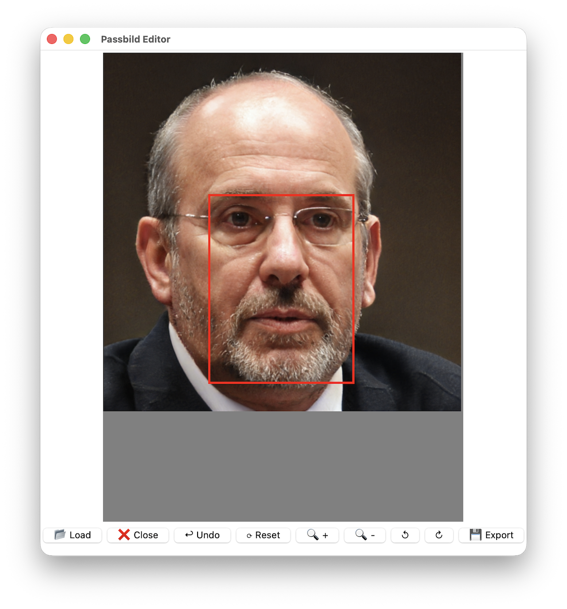

# 📸 Passbild Editor



Ein einfaches Desktop-Tool zum Zuschneiden von Passbildern mit festem Rahmen.

Erstellt mit **Tkinter** und **Pillow**.

---

## ✨ Funktionen

- 📂 Laden von JPG- und PNG-Bildern
- 🔍 Zoom in / out
- ↺ Rotation (90° Schritte)
- 🖱️ Bild frei verschieben (Drag & Drop)
- 🔴 Fester Zuschneiderahmen (Passbild-Verhältnis)
- 💾 Export des zugeschnittenen Bildes

---

## 🆕 Neu in Version 1.0

- ❌ **Bild schließen**, ohne die App zu beenden
- ↩ **Undo-Funktion** (bis zu 20 Schritte)
- ⟳ **Reset View** (Zoom, Rotation, Position zurücksetzen)
- 🚫 **Begrenztes Dragging** (Bild bleibt immer im Rahmen sichtbar)
- 🧠 Automatische Zentrierung, wenn Bild kleiner als Rahmen ist

---

## 🖼️ Verwendung

1. Bild laden
2. Bild anpassen:
   - verschieben (Maus ziehen)
   - zoomen
   - drehen
3. Im roten Rahmen ausrichten
4. **Export** klicken

Das zugeschnittene Bild wird automatisch gespeichert.

---

## 📁 Ausgabe

Die exportierte Datei wird im selben Ordner gespeichert und mit _cropped suffixed.

---

## Geplante Features
- 🖱️ Zoom mit Mausrad
- 🎯 Automatische Gesichtszentrierung
- 📐 Weitere Passbildformate
- 🌙 Dark Mode

---

## Technische Details
- Automatische Bildausrichtung über EXIF (ImageOps.exif_transpose)
- Zuschneiden erfolgt in Originalauflösung
- Zoom und Position werden korrekt umgerechnet

## Requirements
- python3
- python-tk
- uv

## 🚀 Ausführung (mit uv)

```bash
uv run --script passbild.py
```
